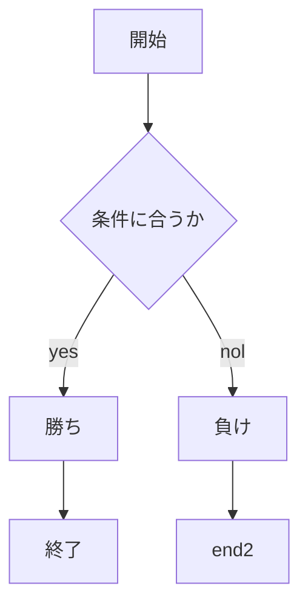
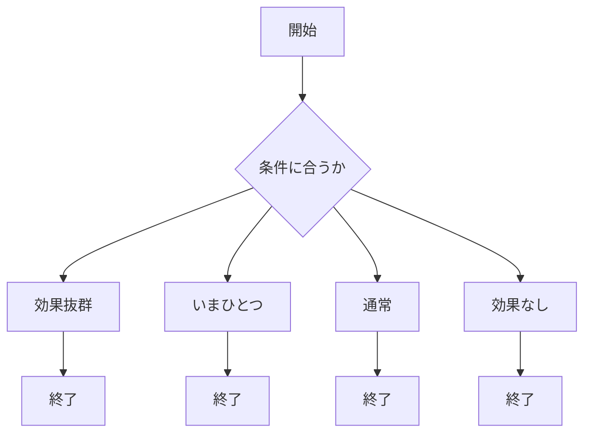
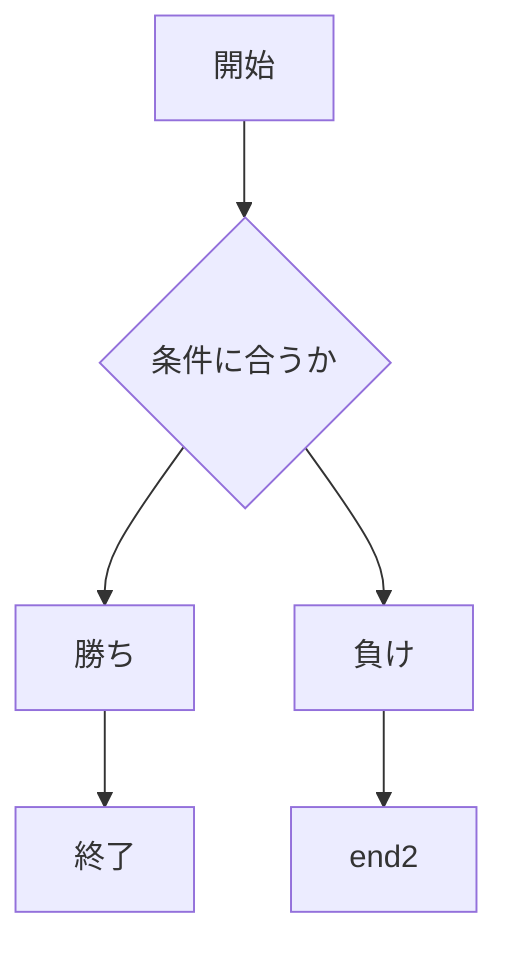

# webpro_06

## このプログラムについて

## ファイル一覧
ファイル | 説明
-|-
app5.js | プログラム本体
public/janken.html | じゃんけんの開始画面
views/janken.ejs | じゃんけんのテンプレートファイル

ファイル | 説明
-|-
app5.js | プログラム本体
public/taipu.html | ポケモンのタイプ開始画面
views/taipu.ejs | ポケモンのタイプテンプレートファイル

###このファイルの機能
ポケモンのタイプを打つとcpuがランダムで出してくるタイプとの相性がわかる．
ファイル | タイプ
-|-
 -| ノーマル
 -| 炎
 -| 水
 -| 草
 -| 電気
 -| 地面
 -| 氷
 -| 格闘
 -| 毒
 -| 飛行
 -| エスパー
 -| 虫
 -| 岩
 -| ゴースト
 -| ドラゴン
 -| アク
 -| 鋼
 -| フェアリー

ファイル | 説明
-|-
app5.js | プログラム本体
public/saikoro.html | サイコロの開始画面
views/saikoro.ejs | サイコロのテンプレートファイル

