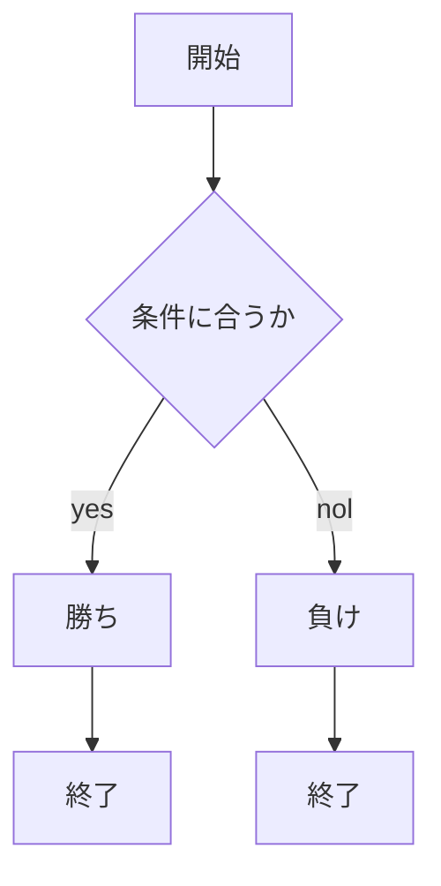
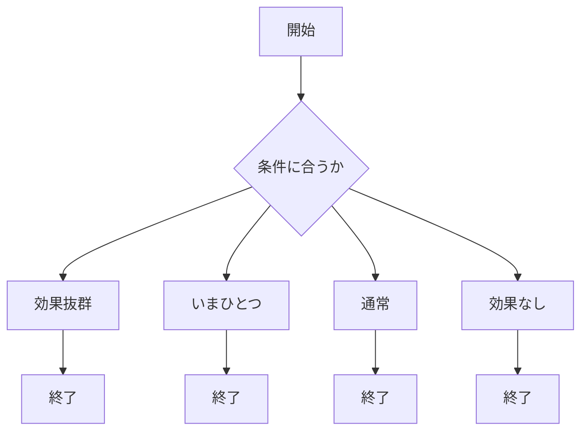
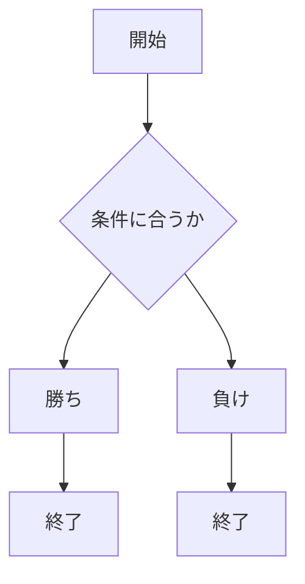

# webpro_06

## このプログラムについて

## ファイル一覧
ファイル | 説明
-|-
app5.js | プログラム本体
public/janken.html | じゃんけんの開始画面
views/janken.ejs | じゃんけんのテンプレートファイル

ファイル | 説明
-|-
app5.js | プログラム本体
public/taipu.html | ポケモンのタイプ開始画面
views/taipu.ejs | ポケモンのタイプテンプレートファイル

###このファイルの機能  
まず，このファイルの起動方法について説明する．ターミナルを開き，node app5.js　と入力する．次に別のターミナルを開き，telnet localhost 8080 と入力する．最後にブラウザでhttp://localhost:8080/taipu にアクセスすることで機能を使用することができる．
gitで管理する方法はプロジェクトディレクトリで次の３つのコマンドを実行することで追加と修正を行うことができる．コメントの部分は別の言葉に変えて実行する．  
$ git add .  
$ git commit -am 'コメント'  
$ git push  
　機能ごとの説明を行う．下記の表にあるタイプと同じようにユーザー側が入力したタイプとランダムに出されるタイプとの相性を判定する．
　使用方法はブラウザでhttp://localhost:8080/taipu にアクセスし，入力フォームに下記の表にあるタイプを入力する．送信ボタンを押すことで効果抜群，通常，効果今一つ，効果なしと入力したタイプとランダムに出されたタイプとの相性が判定される．  
ファイル | タイプ
-|-
 -| ノーマル
 -| 炎
 -| 水
 -| 草
 -| 電気
 -| 地面
 -| 氷
 -| 格闘
 -| 毒
 -| 飛行
 -| エスパー
 -| 虫
 -| 岩
 -| ゴースト
 -| ドラゴン
 -| アク
 -| 鋼
 -| フェアリー

ファイル | 説明
-|-
app5.js | プログラム本体
public/saikoro.html | サイコロの開始画面
views/saikoro.ejs | サイコロのテンプレートファイル

###このファイルの機能  
まず，このファイルの起動方法について説明する．ターミナルを開き，node app5.js　と入力する．次に別のターミナルを開き，telnet localhost 8080 と入力する．最後にブラウザでhttp://localhost:8080/saikoro にアクセスすることで機能を使用することができる．
gitで管理する方法はプロジェクトディレクトリで次の３つのコマンドを実行することで追加と修正を行うことができる．コメントの部分は別の言葉に変えて実行する．  
$ git add .  
$ git commit -am 'コメント'  
$ git push  
使用方法はブラウザでhttp://localhost:8080/saikoro にアクセスし，入力フォームに1~6の数字を一つ入力しランダムに出される数字と同じ数になれば勝ちとなる．