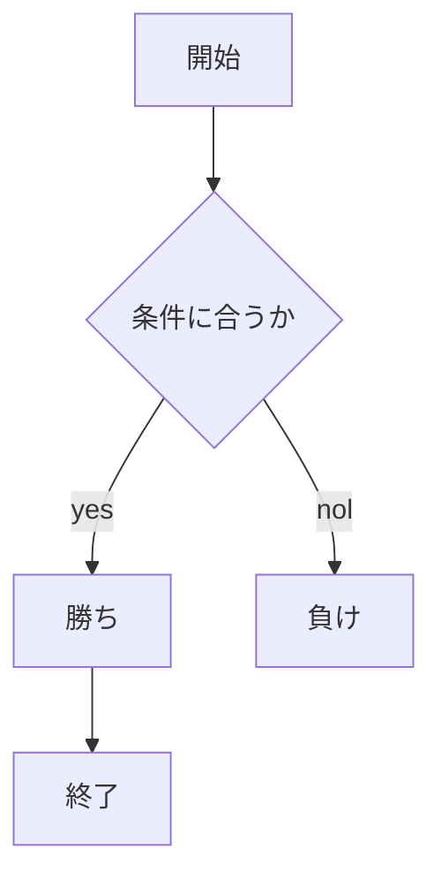
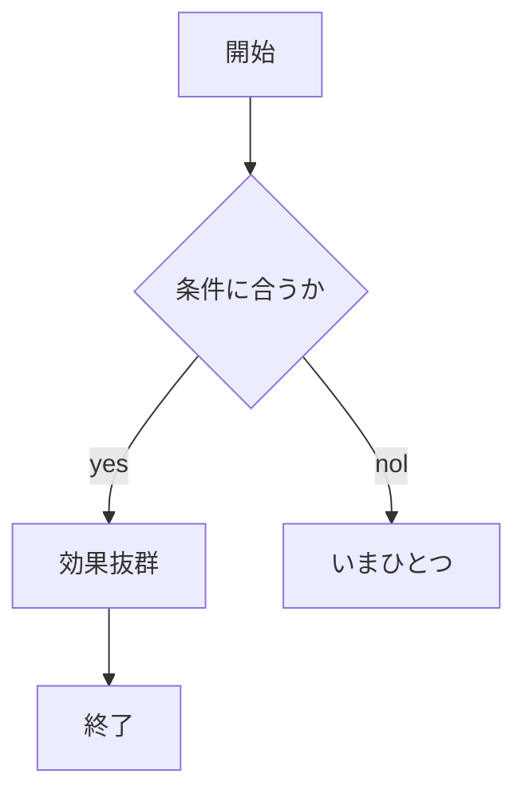

# webpro_06

## このプログラムについて

## ファイル一覧
ファイル | 説明
-|-
app5.js | プログラム本体
public/janken.html | じゃんけんの開始画面
views/janken.ejs | じゃんけんのテンプレートファイル

ファイル | 説明
-|-
app5.js | プログラム本体
public/taipu.html | ポケモンのタイプ開始画面
views/taipu.ejs | ポケモンのタイプテンプレートファイル

